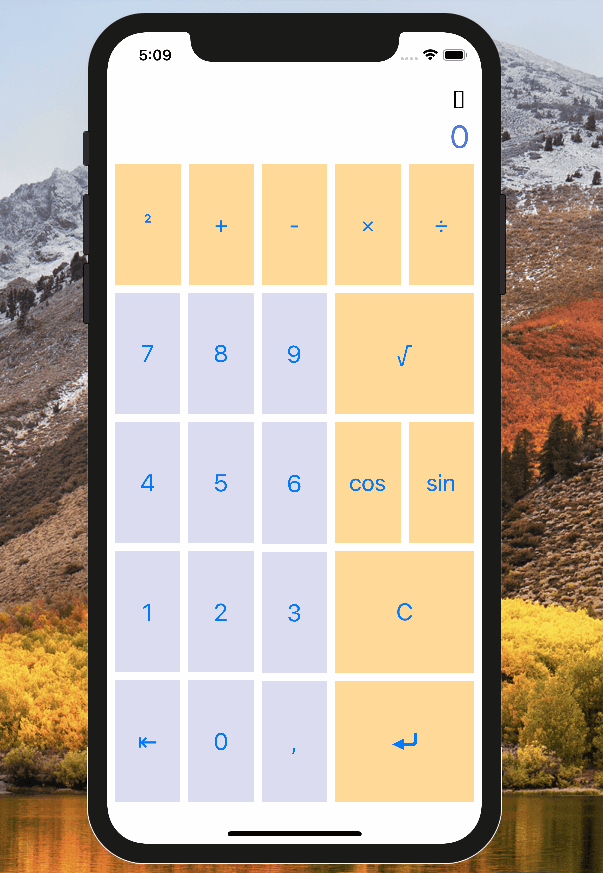

# Reverse Polish Notation (RPN) Calculator

## Reverse Polish Notation (RPN) provides the quickest way to enter data in a calculator because it eliminates the need for parenthesis.

### It is a way of writing a mathematical expressions where each operand is preceded by the two operators it applies to 

## Example :
 ### to calculate 20+50 you would enter : **2, 0, +, 5, 0, ENTER**

 ### using rpn : you would type : **2, 0, ENTER, 5, 0, +**

 